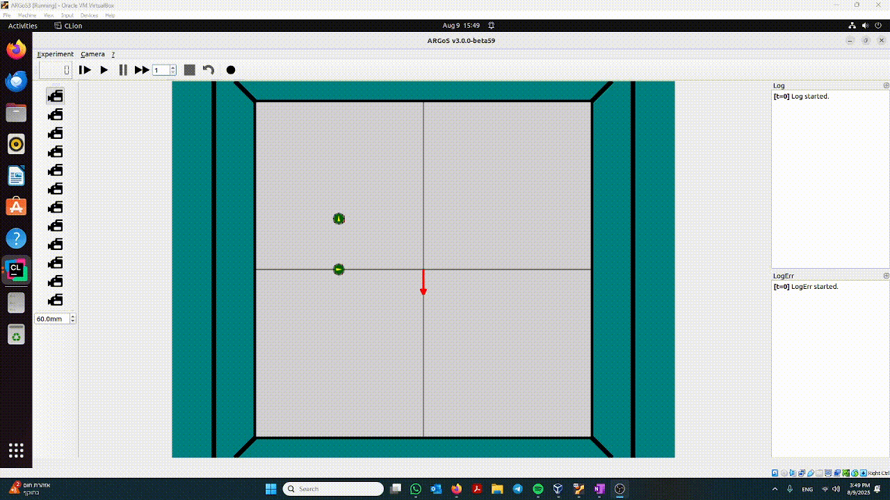

<p align="center">
  
</p>

**What you’re seeing**

- **Wind:** 270° (south), **5 cm/s**. The red arrow points **south**.
- **Controller:** The wind force is applied **in the controller** (the loop-functions here are just for UI/labels), so each tick the robot gets its wheel command plus a southward wind impulse.

**Robots**
- **Top robot (id=2)** – starts at y=+0.3, **facing north** at **5 cm/s**.  
  Wind is **5 cm/s south**, so the vectors cancel:  
  `v_net ≈ (0, +5) + (0, −5) = (0, 0)` → it stays essentially **in place**.
- **Bottom robot (id=1)** – starts at y=0.0, **facing east** at **5 cm/s**.  
  Wind pushes south at **5 cm/s**:  
  `v_net ≈ (+5, 0) + (0, −5) = (+5, −5)` → it moves **diagonally southeast** (forward + downward drift).

*Angle convention (ARGoS):* 0°=east, 90°=north, 180°=west, 270°=south.


# Compiling the code

Make sure you have ARGoS >= 3.0.0-beta52 installed!

Commands:

```shell
mkdir build
cd build
cmake -DCMAKE_BUILD_TYPE=Release ../src
make
sudo make install
```

If ARGoS does not find the new robot, try:

```shell
cmake -DCMAKE_BUILD_TYPE=Release ../src -DCMAKE_INSTALL_PREFIX=/usr
```

For Debug builds:

```shell
cmake -DCMAKE_BUILD_TYPE=Debug
```
